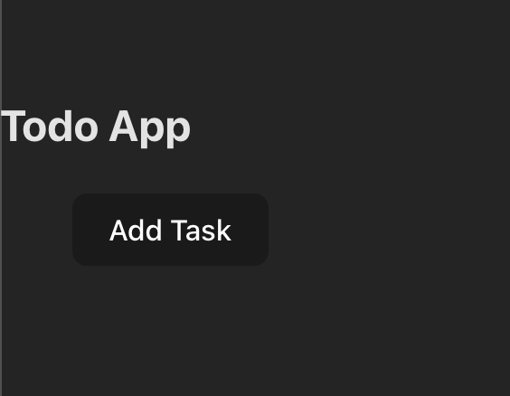
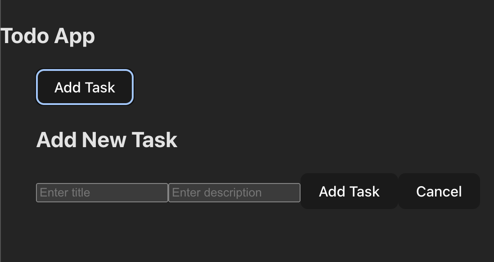
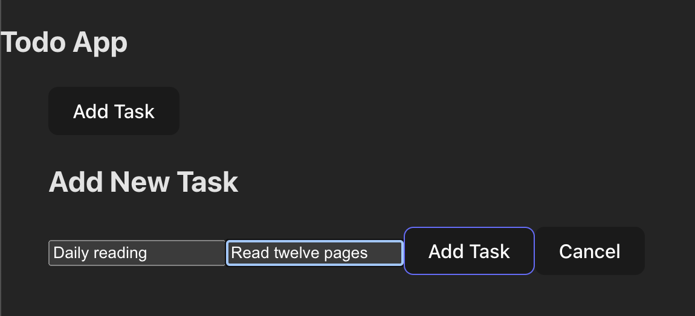
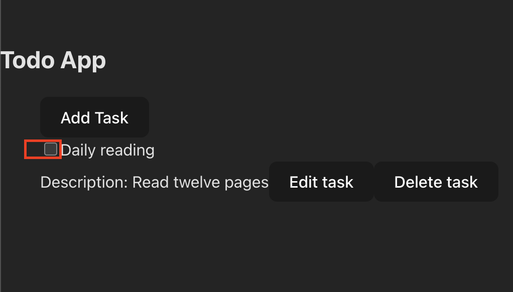
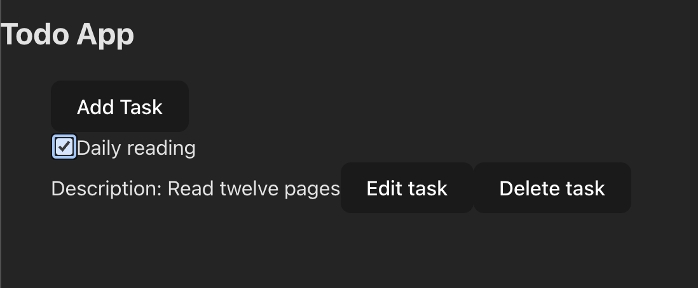

# Project-3

### ¿Qué es mi producto y para que sirve?
Aplicación web para la creación de una lista de tareas, que le permite estar al tanto de las actividades que tiene pendientes por realizar, y las que ya ha realizado de forma satisfactoria.

### ¿Cuáles son las funcionalidades más importantes y porque los usuarios las usarían?
El usuario la primera vez que ingrese a la aplicación, encontrará una lista vacía.  
  
Deberá hacer clic sobre el botón _Add Task_ para insertar tareas.  
  
Una vez haya hecho esto, podrá insertar el título de la tarea y una descripción para la misma.  
  
Si hace clic en _Add Task_, observará la creación de la tarea. Si por el contrario hace clic en _Cancel_, no se añadirá.  
  
Por defecto, se crean con un estado de incumplimiento.   
  
Cuando cumpla la tarea, puede hacer clic sobre el check box.  
  
Si cierra la aplicación y vuelve a abrirla, observará la lista que creó la última vez que usó la app.

